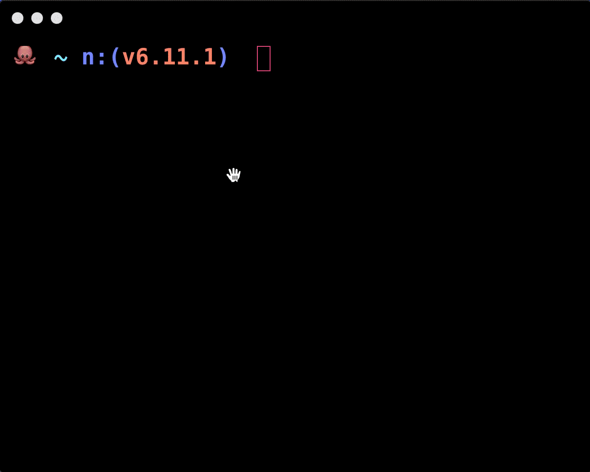

# Hyper Match

[](https://github.com/bnb/awesome-hyper)
[](https://www.npmjs.com/package/hyper-match)

## WARNING: THIS PROJECT IS DEPRECATED
Hyper v2 now uses [xterm.js](https://github.com/xtermjs/xterm.js) which supports link detection out of the box.

An extension for [Hyper](https://hyper.is) that binds commands to patterns detected in the terminal. When a pattern is detected, it is rendered as a hyperlink which will execute your command on click. 

Patterns such as urls, email addresses and file paths can be configured to do anything when clicked, for example: open a browser, email client, or file manager. 

Inspired by [iterm's Triggers](https://www.iterm2.com/documentation-triggers.html).
Based on [hyperlinks](https://github.com/zeit/hyperlinks).



## Usage

[Install Hyper](https://hyper.is/#installation) and add `hyper-match` to `plugins` in `~/.hyper.js`.

### Customizing styles

Add custom styles to `termCSS` in your `~/.hyper.js`.

``` javascript
termCSS: `
    x-screen a {
        color: #ff2e88;
        text-decoration: none;
    }

    x-screen a.hover {
        text-decoration: underline;
    }
`
```

## Configuration
A trigger has the following properties:
- **name:** Unique identifier for a trigger
- **pattern:** A regular expression
- **strategy:** A command to be executed when a link is clicked. `hyper-match` uses [`.replace()`](https://developer.mozilla.org/en-US/docs/Web/JavaScript/Reference/Global_Objects/String/replace) under the hood to output parameters into the supplied strategy.
    - `$&`: Inserts the matched substring.
    - `$`: Inserts the portion of the string that precedes the matched substring.
    - `$'`: Inserts the portion of the string that follows the matched substring.
    - `$n`: Where `n` is a positive integer less than 100, inserts the nth parenthesized submatch string, provided the first argument was a RegExp object. Note that this is 1-indexed.
- **options:** Regular expression options
- **priority:** Defines the weight of a pattern and is used if the pattern conflicts with another
- **linkColor:** A CSS color

**Example:**

``` javascript
module.exports = {
  ...
  config: {
    ...
    'hyper-match': {
        triggers: [
            {
                name: 'date',
                pattern: '^(0[1-9]|1[0-2])[\\/](0[1-9]|[12]\\d|3[01])[\\/](19|20)\\d{2}$',
                options: 'g',
                strategy: 'echo \'$&\' | pbcopy && open "https://calendar.google.com"',
                priority: 1,
                linkColor: '#4285f4',
            },
            {
                name: 'email',
                pattern: '[a-z0-9]+[_a-z0-9\\.-]*[a-z0-9]+@[a-z0-9-]+(\\.[a-z0-9-]+)*(\\.[a-z]{2,4})',
                options: 'gi',
                strategy: 'echo \'$&\' | pbcopy && open "https://mail.google.com"',
                priority: 2,
            },
            {
                name: 'css-color',
                pattern: '#(?:[a-f\\d]{3}){1,2}\\b|rgb\\((?:(?:\\s*0*(?:25[0-5]|2[0-4]\\d|1?\\d?\\d)\\s*,){2}\\s*0*(?:25[0-5]|2[0-4]\\d|1?\\d?\\d)|\\s*0*(?:100(?:\\.0+)?|\\d?\\d(?:\\.\\d+)?)%(?:\\s*,\\s*0*(?:100(?:\\.0+)?|\\d?\\d(?:\\.\\d+)?)%){2})\\s*\\)|hsl\\(\\s*0*(?:360|3[0-5]\\d|[12]?\\d?\\d)\\s*(?:,\\s*0*(?:100(?:\\.0+)?|\\d?\\d(?:\\.\\d+)?)%\\s*){2}\\)|(?:rgba\\((?:(?:\\s*0*(?:25[0-5]|2[0-4]\\d|1?\\d?\\d)\\s*,){3}|(?:\\s*0*(?:100(?:\\.0+)?|\\d?\\d(?:\\.\\d+)?)%\\s*,){3})|hsla\\(\\s*0*(?:360|3[0-5]\\d|[12]?\\d?\\d)\\s*(?:,\\s*0*(?:100(?:\\.0+)?|\\d?\\d(?:\\.\\d+)?)%\\s*){2},)\\s*0*(?:1|0(?:\\.\\d+)?)\\s*\\)',
                options: 'gi',
                strategy: 'echo \'$&\' | pbcopy',
                priority: 1,
            },
        ]
    }
    ...
  }
  ...
}
```
